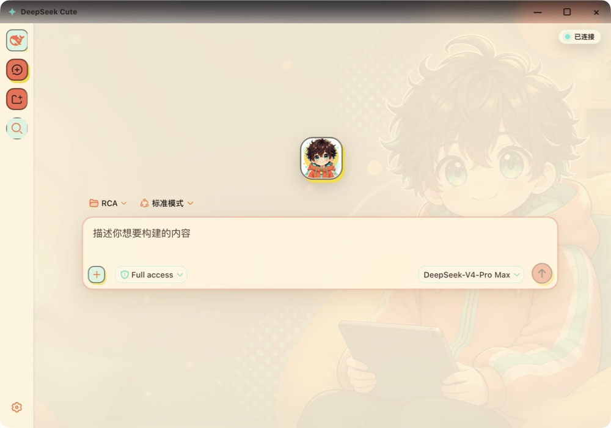

# DeepSeek Cute Desktop

下载即用的本地 DeepSeek 桌面端：五套内置主题 + 主题工坊自定义（更新不丢失）、会互动的桌面宠物、任务完成提醒、Token 使用统计、一键复制对话 Markdown、一键导出诊断信息，以及官方 DeepSeek / 本地千问双模型服务。macOS 和 Windows 都不需要用户额外安装 Node.js 或手动运行 `dsh web`，启动时也不会打开系统浏览器。

[下载最新版](https://github.com/SikeFix/deepseek-cute-desktop/releases/latest)



> 上图为真实应用界面截图。下方三图为 AI 生成的场景展示，用来呈现桌面搭配效果。

## 直接下载

| 系统 | 下载 | 要求 |
| --- | --- | --- |
| macOS Apple Silicon | [DeepSeek-M2-1.7.2.dmg](https://github.com/SikeFix/deepseek-cute-desktop/releases/latest/download/DeepSeek-M2-1.7.2.dmg) | macOS 13.5+，M1/M2/M3/M4 |
| Windows x64 | [DeepSeek-Cute-Windows-x64-Setup-1.7.2.exe](https://github.com/SikeFix/deepseek-cute-desktop/releases/latest/download/DeepSeek-Cute-Windows-x64-Setup-1.7.2.exe) | Windows 10/11 x64 |

## 1.7.2 新功能

- **一键导出诊断信息**：服务异常时，等待页直接显示内核最后报错，并新增「复制诊断信息」按钮（托盘/菜单也有同名入口）；自动汇总应用版本、系统信息、`backend.log`（内核真实报错）与主日志尾部，复制到剪贴板并保存一份 `diagnostics-*.txt` 到日志目录，发给开发者即可定位问题。内容已脱敏，不含任何 API 密钥
- **键盘快捷键（双平台）**：新建会话 `⌘/Ctrl + K` · 复制当前对话为 Markdown `⌘/Ctrl + Shift + C` · 下一个主题 `⌘/Ctrl + T` · 模型服务设置 `⌘/Ctrl + ,` · Token 统计 Windows `Ctrl + Shift + S` / macOS `⌘ + Shift + T`；首次启动显示可关闭的快捷键提示卡
- **复制对话为 Markdown**：一键把当前会话导出为 Markdown（用户/助手分块、工具调用、思考过程、上下文注入、代码块），直接进系统剪贴板
- **Windows 托盘快捷操作**：新建会话、复制当前对话为 Markdown，无需打开窗口即可用
- **macOS 顶栏**：全透明悬浮，吉祥物图标常驻；顶栏可像普通应用一样拖动

## 主题体验

- 五套内置主题：官方样式 / 正太主题 / 暗夜极光 / 奶油纸感 / 深海鲸语，顶部胶囊或菜单栏一键切换，已针对各主题调试对比度
- **主题工坊**：自定义颜色、壁纸、吉祥物形象与欢迎文案，保存为个人主题；主题存于用户目录，**应用更新不丢失**。双端可用，自定义吉祥物同步到桌面宠物与托盘/ Dock 图标
- **Token 使用统计**：累计/峰值 Token、最长聊天时长、活跃热图、近 7/30 日明细与趋势图、模型用量，缓存优先秒开
- 点击应用自动启动本地 DeepSeek 服务，无需终端命令，也不会弹系统浏览器
- 可拖动、可点击、可右键的桌面宠物，思考、完成、错误等状态使用不同表情与动作
- 任务完成时弹出系统通知，点击通知可返回应用
- 主窗口关闭后驻留托盘/菜单栏，后台继续等待任务
- 自动从 GitHub Release 检查并下载更新，显示速度与百分比，下载完成后一键重启安装
- macOS 桌宠专注计时：25/50 分钟专注、10 分钟休息与完成提醒
- macOS 最近任务历史，可从菜单返回最近 8 个完成任务
- macOS 登录时自动启动，以及点击桌宠的随机暖心回应
- 本地服务启动失败自动退避重启（1.5s→30s），残留端口自动清理，Node 堆内存上限 1024MB

## 场景展示（AI 生成）


## 安装提示

### macOS

打开 DMG，把 DeepSeek 拖入“应用程序”。发布包为社区构建，采用 ad-hoc 签名、未做 Apple 公证；若系统首次拦截，请在 Finder 中右键应用并选择“打开”。

### Windows

下载 Setup EXE 后双击，只需完成一次安装，之后从桌面快捷方式启动。当前发布包未购买商业代码签名证书，Windows 可能显示 SmartScreen 提示；请先核对本页 SHA256，再自行决定是否运行。

## 校验值

```text
767f7f7585b945194fb60b554ccaff92b00c16ae722ad09cbd3e054027197c2a  DeepSeek-M2-1.7.2.dmg
27d8cc88f8e5a8cb4344067b14418585d8ae4e9abbd1b5af3a0891af9c97b047  DeepSeek-Cute-Windows-x64-Setup-1.7.2.exe
```

## 说明

- 模型 API 密钥仅保存在 macOS 钥匙串 / Windows DPAPI 加密存储，注入为环境变量供内核使用，不写入 GitHub、DSH 设置文件或应用日志；本地千问端点强制 HTTPS。
- 模型账号、登录状态和工作区数据仍由每台电脑分别管理，不会打包进安装文件。
- macOS 1.7.2 已在 M2 环境完成编译、ad-hoc 签名、DMG 挂载与内置 0.1.1-rc.2 运行时验证（从 DMG 镜像直接启动，本地服务 200）。
- Windows 1.7.2 由 GitHub Actions 在 windows-latest 完成 electron-builder x64 构建，打包后逐文件自检关键运行时（缺失即构建失败），并核对 NSIS 更新元数据与差分 blockmap。
- 项目不是 DeepSeek 官方产品，详情见 [NOTICE.md](NOTICE.md)。

## 源码

- `windows/`：Electron 壳、主题注入、桌宠、托盘与内置服务管理
- `macos/`：Swift + WebKit 原生壳、菜单栏、桌宠与服务管理

源码采用 MIT License。构建依赖和内置运行时保留各自许可证。
